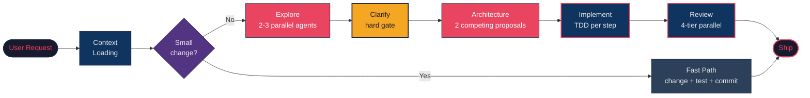

# Claude Flow

A multi-agent code creation workflow for [Claude Code](https://docs.anthropic.com/en/docs/claude-code). Replaces single-pass coding with a structured 6-phase pipeline: parallel exploration, competing architecture proposals, TDD implementation, and registry-driven quality review.

## Why use this instead of vanilla Claude Code?

Claude Code's default mode is a single-pass loop: read a few files, form a mental model, write code, commit. This works for small changes but falls apart on complex features where assumptions compound. Claude Flow replaces that with a structured multi-agent pipeline:

- **Deep exploration before coding.** 2-3 parallel Opus subagents map codebase patterns and architecture before the main session touches code. The main session then reads the top 5-10 source files itself so it has firsthand knowledge of the code, not just agent summaries.
- **Token-efficient context.** A bundled repo outline script extracts function and class signatures without their bodies, so Claude sees the full codebase structure without burning context tokens on implementation details.
- **Hard-gated clarification.** All ambiguities (edge cases, error handling, scope boundaries) must be resolved with you before architecture begins, so Claude doesn't build the wrong thing based on assumptions.
- **Competing architectures.** Two architect agents (simplicity vs. separation) produce proposals you choose between rather than getting a single take-it-or-leave-it design.
- **Strict TDD with defensive patterns.** Test-first per plan step, with guard clauses, no-silent-swallow rules, and state management injected automatically based on whether the step touches UI or backend.
- **4-tier parallel review.** 5+ agents (code review, silent failure hunting, security, test coverage analysis) plus conditional specialists (migration, async, API audit) that fire only when relevant file types appear in the diff.
- **Context persistence across sessions.** Hook scripts handle pre-compaction transcript backup, post-commit memory updates, and session-start context reloading so the next session doesn't start from scratch.

## How it works



## Install

Skills live in a separate repo ([claude-skills](https://github.com/sumrae412/claude-skills)) as the single source of truth. Clone it as a sibling directory first, then install claude_flow:

```bash
# 1. Clone claude-skills (the canonical skill library)
git clone https://github.com/sumrae412/claude-skills.git ~/claude_code/claude-skills

# 2. Clone and install claude_flow
git clone https://github.com/sumrae412/claude_flow.git ~/claude_code/claude_flow
cd ~/claude_code/claude_flow
./install.sh
```

`install.sh` symlinks `~/.claude/skills/` to the claude-skills checkout (edits go live immediately — no reinstall after changing a skill), copies scripts to `~/.claude/scripts/`, hooks to `~/.claude/hooks/claude-flow/`, memory files to `~/.claude/memory/`, and the MCP server to `~/.claude/mcp/claude-flow/`.

To also generate stack-specific Tier 2 hooks (lint, test, migration check, type-check) based on your project's detected stack:

```bash
./install.sh --generate-hooks
```

## Usage

After installing, invoke in Claude Code:

```
/claude-flow
```

Or describe what you want to build — the workflow triggers automatically for complex features. Small single-file changes use a fast path that skips the full pipeline.

For bug fixes, use `/bug-fix` — a dedicated 4-step pipeline (Reproduce, Diagnose, Fix, Verify).

## What's included

### Core workflow

**claude-flow** — The main orchestrator. 6 phases:

| Phase | What happens |
|-------|-------------|
| 0 Context | Load project identity, classify task, load relevant skills |
| 0.5 Hooks | Auto-detect stack, generate Claude Code hooks (one-time) |
| 1 Discovery | Triage: fast-path, plan-path, explore-path, bug-path, or full workflow |
| 2 Exploration | 2-3 parallel code-explorer subagents map the codebase |
| 3 Clarification | Resolve all ambiguities before architecture (hard gate) |
| 4 Architecture | 2 parallel architect proposals, advisor critique, user picks |
| 5 Implementation | TDD per step, parallel dispatch for independent work |
| 6 Quality | Registry-driven cascading review, static analysis, verification |

### Bundled skills (23)

**Enforcement:**
- `coding-best-practices` — Python, JS, API, testing, performance standards
- `defensive-ui-flows` — Guard clauses, state flags, overlay feedback for UI
- `defensive-backend-flows` — Error handling, data migrations, service-layer patterns
- `production-readiness-check` — Infrastructure and ops-level readiness checks

**Workflow:**
- `writing-plans` — Structured implementation plans
- `executing-plans` — Plan execution with review checkpoints
- `test-driven-development` — TDD discipline with anti-patterns reference
- `subagent-driven-development` — Parallel agent dispatch for independent tasks
- `verification-before-completion` — Pre-commit verification gate
- `shipping-workflow` — End-to-end shipping pipeline (commit, PR, review, merge)

**Diagnostics:**
- `bug-fix` — Dedicated bug-fix pipeline (Reproduce, Diagnose, Fix, Verify)
- `investigator` — Evidence collection from 6 source types without proposing fixes
- `hook-doctor` — Diagnose hook health: missing files, bad exit codes, env issues
- `debate-team` — Cross-model adversarial review (DeepSeek + GPT-4o + Haiku)
- `lint-memory` — 4 health checks: broken links, orphans, stale entries, contradictions

**Research & Context:**
- `research` — Multi-agent research team with staggered waves and confidence-scored synthesis
- `fetch-api-docs` — Fetch API docs before coding against external services
- `session-learnings` — Capture discoveries after committing work
- `session-handoff` — Export session state or archive dead-end approaches
- `smart-exploration` — Task-typed exploration prompts for Phase 2
- `memory-injection` — Inject project gotchas into subagent prompts
- `prompt-optimization` — A/B test and promote subagent prompts

**Branch management:**
- `finishing-a-development-branch` — Branch completion (merge/PR/cleanup)

### Hook system

Three-tier hook architecture for automated enforcement and context management:

| Tier | Count | Description |
|------|-------|-------------|
| 1 — Universal | 16 | Always-on: secret detection, git safety, session lifecycle, pre-compaction backup, decision journal, phase gates, metronome, build-before-commit, todo cleanup, worktree cleanup, short-approval challenge |
| 2 — Stack-specific | 14 | Auto-detected by `install.sh`: lint-on-save (js/py), test-on-save (js/py), pre-edit lint gates, type-check, migration check, docker rebuild reminder, gotcha detector, context-rot detection, stale-tool-output, quality-gate-on-stop, memory-triage-on-stop |
| 3 — Project-specific | — | User-configured per repo, not bundled |

**Generate hooks for your stack:**
```bash
./install.sh --generate-hooks
```

This detects your stack (Node, Python, TypeScript, Docker, Alembic, etc.) and outputs the relevant Tier 2 hook configuration.

**Diagnose hook issues:**
```
/hook-doctor
```

### Self-debugging agents

Autonomous failure detection, diagnosis, and retry for Phases 5-6. When a test, lint check, or review fix fails:

1. The retry loop classifies the error against the **failure catalog** (`memory/failure-catalog.md`)
2. Known patterns are fixed automatically using documented strategies
3. Novel failures dispatch a **diagnosis subagent** that identifies root cause and proposes a fix
4. New patterns are validated before being added to the catalog
5. All events are logged to `memory/failure-events.jsonl` for trend analysis

Fully autonomous — user only sees failures that survive 3 retry attempts.

### Prompt optimization

Closed-loop A/B testing for subagent prompts. Measures whether prompts dispatched to explorers, architects, and reviewers actually produce good results, then promotes winners and generates challengers.

| Agent Type | Phase | What's Measured |
|-----------|-------|----------------|
| Explorer | 2 | Were discovered files actually used in implementation? |
| Architect | 4 | Was this proposal chosen? Did it converge quickly? |
| Reviewer | 6 | Were reported issues real and worth fixing? |

Run `/prompt-optimization` to see current variant performance.

### 3-tier memory system

Inspired by cognitive science's memory types, adapted for agentic workflows:

- **Episodic** — Raw event traces (exploration outcomes, failures, phase timings)
- **Semantic** — Generalized patterns extracted from episodic data (failure catalog, pattern library)
- **Procedural** — Learned optimizations (A/B tested prompt variants, proposed skill updates)

Data flows from episodic events through a pattern detector into semantic patterns and procedural proposals.

### Memory operations

Treat memory as operational state, not a junk drawer with markdown branding.

- **Review:** Run `/lint-memory` when memory starts feeling stale or noisy. It checks broken links, orphan files, stale references, and contradictions.
- **Import:** Put exported context from another LLM into a review file first. Promote only durable project facts, decisions, preferences, and recurring gotchas into memory.
- **Archive:** Keep dated memory snapshots before large rewrites or cleanup passes. Prefer archives outside the active project when you need protection from accidental edits.
- **Restore:** Diff an archive against current memory before restoring. Restore selected files only; do not overwrite uncommitted memory changes.

```bash
# Import a memory/context dump into a review file
python scripts/import_memory_dump.py imported-context.md --out memory/IMPORT_REVIEW.md

# Create a dated memory archive
python scripts/memory_archive.py create --memory-dir memory

# List archives
python scripts/memory_archive.py list

# Diff an archive against current memory
python scripts/memory_archive.py diff <archive-id> --memory-dir memory
```

`IMPORT_REVIEW.md` is a staging file. Promote entries manually; do not treat
it as canonical memory.

Project-specific rules belong in `AGENTS.md` / `CLAUDE.md`. Durable gotchas belong in project memory. Keep global Claude memory small and avoid duplicating the same rule everywhere unless it is genuinely global.

### Session intelligence

- **Decision journal** — Tier 1 hook that periodically reminds Claude to log design decisions to `.claude/session-log.md`. Fires every 10 file edits.
- **Abandon/archive workflow** — `/session-handoff --abandon` creates structured records of failed approaches in `.claude/abandoned/`, preventing re-exploration of dead ends in future sessions.
- **Exploration path** — Phase 1 routes experimental work ("spike", "prototype") to a lightweight sandbox with a 60/100 quality bar (no TDD, no Phase 6 review). Successful experiments graduate into the full workflow.
- **Reviewer registry** — Phase 6 reviewer selection driven by `reviewer-registry.json`. Add project-specific reviewers by dropping a `reviewer-registry.json` in your project's `.claude/` directory.
- **Project-local plans** — Plans save to `docs/plans/` (git-tracked) by default.

### Workflow state machine

Phase transitions are governed by a state machine persisted to `.claude/workflow-state.json`. Each phase validates required inputs, records outputs, and gates entry to downstream phases. Supports resume-from-checkpoint after context compaction or session restart.

### MCP server

A [Model Context Protocol](https://modelcontextprotocol.io/) server that exposes workflow state to external tools and IDE integrations.

| Type | Name | Description |
|------|------|-------------|
| Resource | `workflow://state` | Current phase, active agents, last checkpoint |
| Resource | `workflow://memory` | Project memory files |
| Resource | `workflow://hooks` | Hook registry and last-run status |
| Resource | `workflow://outline` | Latest repo outline (signatures without bodies) |
| Resource | `workflow://session` | Active session context and loaded skills |
| Tool | `query_state` | Query workflow state with a natural-language filter |
| Tool | `search_memory` | Full-text search across all memory files |
| Tool | `check_hook_health` | Run hook-doctor diagnostics |
| Tool | `inject_context` | Push a context block into the next subagent prompt |

**Register in `~/.claude/settings.json`:**
```json
{
  "mcpServers": {
    "claude-flow": {
      "command": "python3",
      "args": ["~/.claude/mcp/claude-flow/server.py"]
    }
  }
}
```

### Automated PR review

An Agent SDK app (`agent-sdk/pr-reviewer/`) that runs the Phase 6 quality review headlessly against any PR diff — no interactive Claude session required.

- Tier 1 checks always run: silent failure hunting, security audit, code review
- Tier 2 checks fire conditionally: migration safety, async patterns, API contract audit
- PRs under 50 lines use a single combined reviewer instead of fanning out

**Provider-pluggable.** Select via `PR_REVIEWER_PROVIDER`:

| Provider | Models | Caching | Notes |
|----------|--------|---------|-------|
| `anthropic` (default) | Claude Sonnet/Opus via `ANTHROPIC_MODEL` | Ephemeral prompt cache (~90% input discount within 5-min TTL) | Requires `ANTHROPIC_API_KEY` |
| `nvidia` | Free-tier hosted models (OpenAI-compatible) via `NVIDIA_MODEL` or `NVIDIA_MODEL_POOL` | None | Comma-separated pool fans out in parallel; `triage.ts` dedupes overlap |

**Optional fallback chain.** Set `PR_REVIEWER_FALLBACK_PROVIDER=anthropic` alongside an NVIDIA primary to get free-first with a paid safety net — on primary throw, the wrapper retries via fallback.

**A/B comparison.** `npm run compare -- <PR>` runs the same diff through Anthropic and NVIDIA in parallel, then uses the existing Dice-similarity dedup as an overlap oracle to report shared vs. side-unique findings.

**GitHub Actions integration** (Anthropic-pinned in CI; non-Anthropic providers are local/opt-in):

```yaml
- uses: sumrae412/claude-flow-pr-review@v1
  with:
    anthropic_api_key: ${{ secrets.ANTHROPIC_API_KEY }}
```

See [CLAUDE.md](CLAUDE.md) for known NVIDIA gotchas (aggressive overshoot framing is filtered — soft prompt variants are dispatched automatically; model IDs are versioned).

### Scripts

**Analysis:**
- `generate_repo_outline.py` — Extract function/class signatures without bodies (token-efficient codebase context)
- `plancraft_review.py` — Multi-model AI plan review
- `prompt-tracker.py` — Prompt variant selection, outcome recording, and performance reporting
- `thinking-budget.py` — Dynamic thinking budget selection based on complexity tier and domain retry rates
- `dashboard.py` — Performance dashboard across episodic event data
- `pattern-detector.py` — Extract semantic patterns from episodic events

## Project structure

```
claude_flow/
├── hooks/                      # Tier 1 & 2 hook implementations
│   ├── hook-registry.json       # Single source of truth for hook selection
│   ├── tier1/                   # 16 universal hooks (always-on)
│   └── tier2/                   # 14 stack-specific hooks (conditional)
├── scripts/                    # Utility and analysis scripts
├── memory/                     # 3-tier memory system
│   ├── episodic/                # Raw event traces
│   ├── semantic/                # Generalized patterns
│   └── procedural/              # Learned optimizations
├── mcp/                        # Model Context Protocol server
│   └── claude-flow-server/
├── agent-sdk/                  # Headless PR review agent
│   └── pr-reviewer/
├── docs/                       # Design documents and plans
│   ├── plans/                   # 20+ design docs
│   └── superpowers/             # Capability specs
├── reviewer-registry.json      # Phase 6 reviewer selection config
├── install.sh                  # Installer
├── REVIEW.md                   # Review standards
└── LICENSE                     # MIT
```

## Updating

Pull the latest and re-run the installer:

```bash
cd claude_flow
git pull
./install.sh
```

## Uninstall

Remove the installed skills, scripts, hooks, and MCP server:

```bash
# Remove the skills symlink (claude-skills repo itself is not deleted)
rm -f ~/.claude/skills

# Remove scripts
rm -f ~/.claude/scripts/generate_repo_outline.py
rm -f ~/.claude/scripts/plancraft_review.py
rm -f ~/.claude/scripts/prompt-tracker.py
rm -f ~/.claude/scripts/thinking-budget.py
rm -f ~/.claude/scripts/dashboard.py
rm -f ~/.claude/scripts/pattern-detector.py
rm -f ~/.claude/scripts/review-proposals.py
rm -f ~/.claude/scripts/emit-failure-event.sh
rm -f ~/.claude/scripts/emit-phase-event.sh
rm -rf ~/.claude/scripts/hooks/

# Remove hooks
rm -rf ~/.claude/hooks/claude-flow/

# Remove MCP server
rm -rf ~/.claude/mcp/claude-flow/

# Remove memory files (optional — these accumulate project-specific data)
# rm -rf ~/.claude/memory/
```

## Future work

- **Issue-tracker entry point** — Start from a Linear/Jira/GitHub issue instead of a user prompt, pulling in structured acceptance criteria and reproduction steps automatically.
- **External knowledge sources in Phase 2** — Pull context from Obsidian, Apple Notes, or a docs directory to give subagents richer domain context.
- **Priority-ranked review feedback** — Triage Phase 6 findings into Critical (auto-fix), Medium (present for user decision), and Low (log but skip).
- **Cross-LLM task routing** — Route subagent tasks to best-fit LLM CLI (Codex, Gemini, Claude, Cursor) based on task characteristics.

## Acknowledgments

Claude Flow builds on ideas, patterns, and code from several open-source projects and resources. Thank you to:

- **[Archon](https://github.com/coleam00/archon)** by Cole Medin ([@coleam00](https://github.com/coleam00)) — Environment variable sanitization pattern (Phase 0.5), `$nodeId.output` variable substitution pattern for inter-phase data flow, and "fresh context per iteration" pattern for long TDD cycles.
- **[claude-memory-compiler](https://github.com/coleam00/claude-memory-compiler)** by Cole Medin — Inspiration for the memory compilation system, based on Andrej Karpathy's LLM Knowledge Base architecture.
- **[claude-workflow](https://github.com/anthropics/claude-workflow)** — `WorkflowStateManager`, `SchemaValidator`, and `phase-tracker` patterns adapted (not imported) for the workflow state machine.
- **[shinpr/metronome](https://github.com/shinpr/metronome)** (MIT) — Step-skipping detection hook adapted for the claude-flow tier-1 hook pattern.
- **[Pimzino/claude-code-spec-workflow](https://github.com/Pimzino/claude-code-spec-workflow)** by Pimzino — Inspiration for the requirements validation and structured specification approach in Phase 3.
- **[loki-mode](https://github.com/loki-mode)** — RARV (Reason-Act-Reflect-Verify) cycle pattern, adapted as the pre-review self-assessment step in Phase 6.
- **[Better-Harness](https://github.com/better-harness)** — "One change at a time to avoid confounding" principle, applied to the workflow retrospective.
- **[HardEval](https://arxiv.org/abs/2407.21227)** — Cognitive complexity classification framework (arXiv 2407.21227), adapted for the task complexity classifier in Phase 1 Discovery.
- **[Claude Cookbook](https://docs.anthropic.com/en/docs/claude-cookbook)** by Anthropic — Context engineering patterns, evaluator-optimizer loop for review fix iteration, and building evals / tool evaluation patterns for reviewer calibration.
- **Cognitive science literature** — 3-tier memory architecture (episodic, semantic, procedural) adapted for agentic workflows.

## License

MIT. See [LICENSE](LICENSE).
